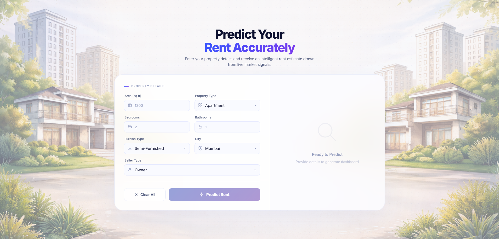

# Rent Price Predictor

A Python-based web application that predicts monthly residential rents in India using **Linear Regression**.

## 📸 Snapshot


## 📊 How It Works
The application uses a trained Machine Learning pipeline to process property data and generate estimates.

1.  **Data Processing (`model/train.py`)**:
    *   **Preprocessing**: Uses `ColumnTransformer` to apply `StandardScaler` to numerical data (Bedroom, Bath, Area) and `OneHotEncoder` to categorical data (City, Type, Furnishing, Seller).
    *   **Pipeline**: Combines preprocessing and `LinearRegression` into a single Scikit-learn Pipeline.
    *   **Dataset**: Uses `_All_Cities_Cleaned.csv` located in `model/data/`.
2.  **Backend (`app.py`)**:
    *   Loads the trained `model.pkl` using `joblib`.
    *   Exposes a `/predict` endpoint that receives JSON data from the UI and returns the calculated price.
3.  **Frontend (`templates/index.html`)**:
    *   Captures user inputs for area, city, and property features.
    *   Displays a dashboard with the prediction and a fixed 89% Model Reliability (R²) score.

## 📁 Folder Structure
```text
📂 rent-price-predictor
├── 📂 model/
│   ├── 📂 data/            # Contains _All_Cities_Cleaned.csv
│   ├── train.py            # Model training script
│   └── model.pkl           # Trained Scikit-learn Pipeline
├── 📂 static/              # Contains home.png background
├── 📂 templates/           # Contains index.html UI
└── app.py                  # Flask Application Backend
```

## 🛠 Features
*   **Model-Driven Estimations**: Utilizes a serialized Scikit-learn pipeline for deterministic price calculations.
*   **Data Integrity & Validation**: Implements strict front-end and back-end checks to ensure valid input ranges.

## ⚙️ Setup
1.  **Install Required Libraries**:
    ```bash
    pip install flask pandas scikit-learn joblib
    ```
2.  **Run Server**:
    ```bash
    python app.py
    ```
